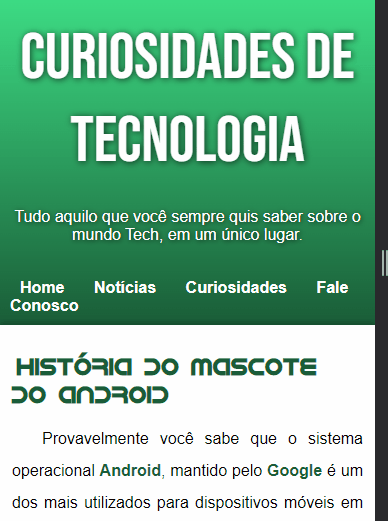

# História do Mascote do Android

# <strong>Sobre e Objetivo</strong> 🎯

Projeto foi criado como desafio proposto no curso Curso em Vídeo- módulo 2, com o intuito de explicar de como surgiu o mascote do nosso querido sistema operacional Android, as suas versões e de aplicar os conceitos aprendidos em aula sobre HTML e CSS intermediários. 

Alguns métodos utilizados no projeto: HTML Semântico; Responsividade;

# <strong>Status</strong> 🎯
Projeto Origem-logo-android:  concluído ✅

### <strong>Curiosidade- Este projeto é sem fins lucrativos e foi feito apenas como meio de aprendizado.</strong>
 

## Tecnologias

<ul>
    <li>HTML</li>
    <li>CSS</li>
    <li>GIT</li>
</ul>

# Dificuldades ⚔

Tive dificuldade com a responsividade do conteúdo principal, isto é: alinhar ao centro da tela e o texto acompanhando o tamanho da tela, sendo resolvido  respectivamente, mais tarde com margin: auto e dando uma largura minima e uma máxima para o conteúdo principal;

A inserção do vídeo foi um problema no início, pois o mesmo nao se adequava junto ao restante do conteúdo principal. Foi resolvido com responsividade, utilizando a tag picture e suas propriedades de media queries.
